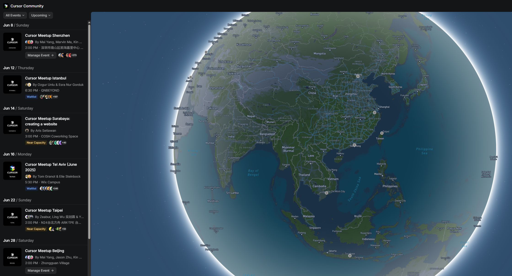

  
WeChat

  
加入微信群

  

---

<GlowBackground>
  <h1 class="text-6xl md:text-8xl font-bold tracking-tight text-white">Cursor Meetup Shenzhen</h1>
</GlowBackground>

---
layout: center
class: text-center
---

Community

Cursor 中文社区的故事

  
Mai Yang

  
Marvin Ma

  
Jason Zhu

  
Kin Gao

---
layout: center
class: text-center
---

Community

Community Map

---
layout: center
---

Agenda

  

    1.
    Greetings from Cursor!
  

  

    2.
    Marvin Ma: Cursor: Yesterday, Today, Tomorrow
  

  

    3.
    清酒: Cursor 怎么帮我在电商持续掘金？
  

  

    4.
    Cursor x 企业应用
  

  

    5.
    中场休息
  

  

    6.
    Cursor x 使用技巧
  

  

    7.
    Cursor x 项目展示
  

  

    8.
    Cursor Face to Face: Product Feedback
  

  

    9.
    Networking
  

---
layout: center
class: text-center
---

Greetings from Cursor!

---
layout: center
class: text-center
---

Speaker

Marvin Ma

Cursor: Yesterday, Today, Tomorrow

---
layout: center
class: text-center
---

Speaker

清酒

Cursor 怎么帮我在电商持续掘金？

---
layout: center
class: text-center
---

Topic

企业应用

  

    
Devansh

    
Cursor in Startups: Iterating Fast

  

  

    
程建辉

    
AI 驱动的代码革命：Cursor 在进门的落地启示

  

---
layout: center
class: text-center
---

中场休息

  Post #CursorMeetupShenzhen on X (Twitter)

Get a limited edition Cursor sticker!

  <a href="https://x.com/benln" target="_blank" class="flex items-center gap-2 hover:text-blue-400"><carbon:logo-x /> @benln</a>
  <a href="https://x.com/CursorChina" target="_blank" class="flex items-center gap-2 hover:text-blue-400"><carbon:logo-x /> @CursorChina</a>

---
layout: center
class: text-center
---

Topic

使用技巧

  

    
Ceyu

    
如何将 Cursor 用于生产级别的开发协作

  

  

    
Thor

    
如何使用Cursor+Figma MCP+团队组件库高度还原设计稿

  

  

    
石先念

    
vibe coding 之前 vibe 点什么

  

---
layout: center
class: text-center
---

Topic

项目展示

  

    
樊锴，张昊然

    
Motiff + Cursor: From Vibe Design to Coding

  

  

    
姜山Sean

    
如何使用 Cursor 开一家 AI 公司

  

---
layout: image-right
image: https://images.spr.so/cdn-cgi/imagedelivery/j42No7y-dcokJuNgXeA0ig/d4ff472a-55f2-4af4-94fb-415471b8abbf/22C20C24-BBE0-44DA-9F77-0A0ADB49DB5A/w=1024,quality=100,fit=scale-down
imageClass: rounded-lg
class: text-left
---

Special Guest

Ben Lang

Cursor Face to Face: Product Feedback

  <a href="https://x.com/benln" target="_blank" class="flex items-center gap-2 hover:text-blue-400">
    <carbon:logo-x /> @benln
  </a>

---
layout: center
class: text-center
---

Special Thanks

  

    场地赞助:
    

  

  

    限量款徽章设计:
    
戈丁

  

  

    策划组 & 志愿者:
    

      Helios, 邵佳琪, Fenix, 戈丁, Kang, 张震, 李兆龙, Tecvan, Murphy, Jacky, Vio, 陈琨, 御, 腾艺萌, 霁风
    

  

  

    感谢远道而来的朋友们!
  

  

    感谢参会的每一个人!
  

---
layout: center
class: text-center font-mono
---

Thank You

  #CursorMeetupShenzhen

  <a href="https://x.com/benln" target="_blank" class="flex items-center gap-2 hover:text-blue-400"><carbon:logo-x /> @benln</a>
  <a href="https://x.com/CursorChina" target="_blank" class="flex items-center gap-2 hover:text-blue-400"><carbon:logo-x /> @CursorChina</a>

